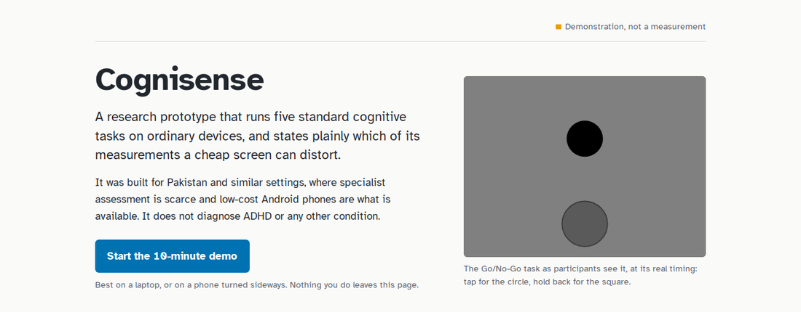
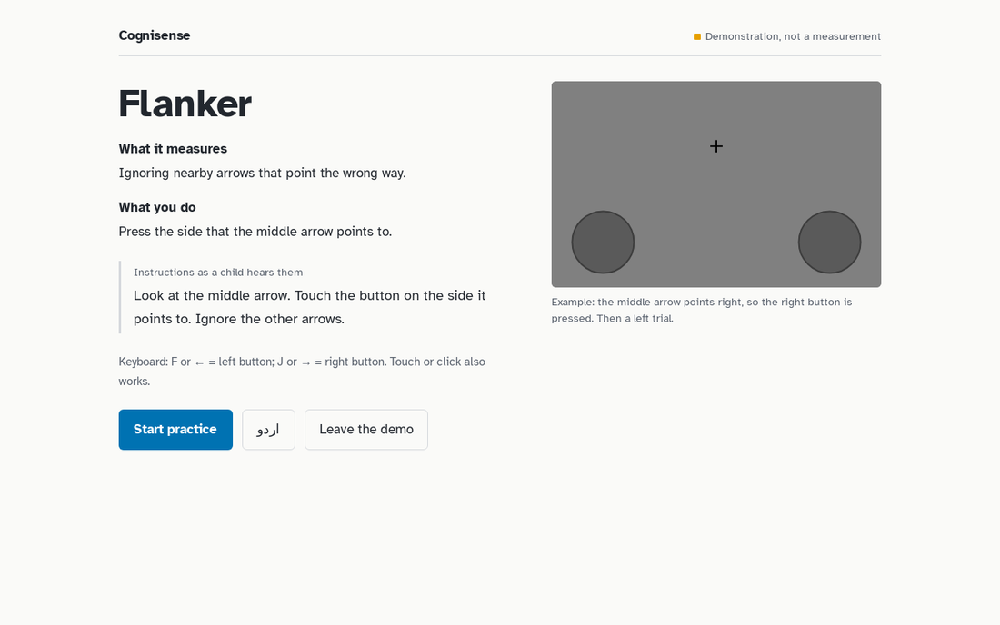
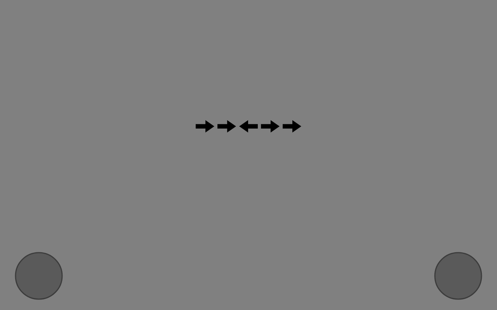
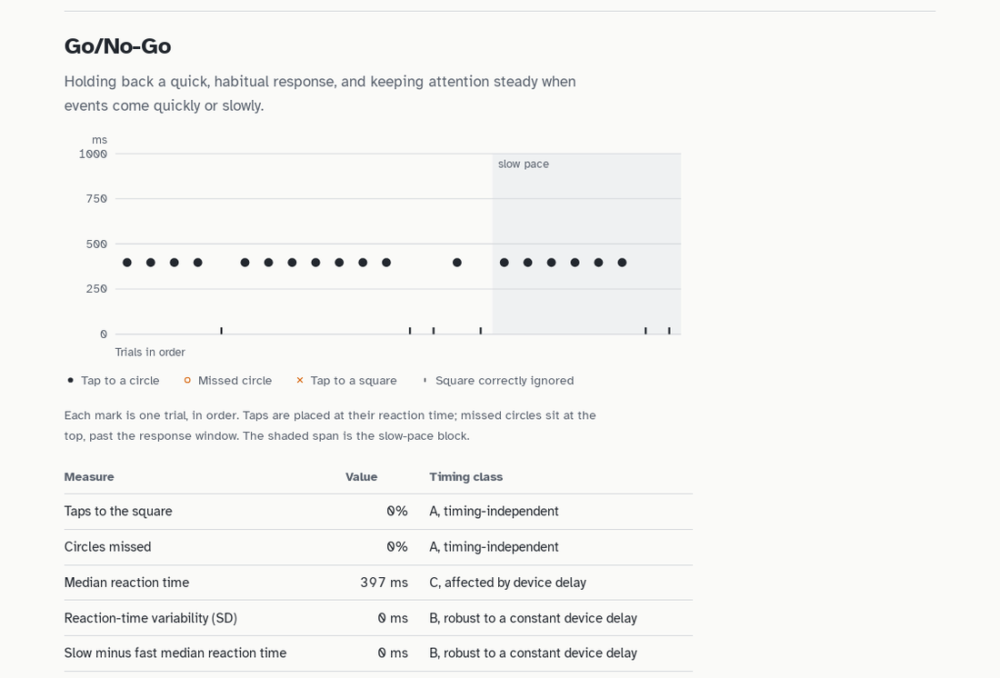

# Cognisense

**An open-source, offline research prototype that runs five standard cognitive tasks in a browser or on low-cost Android phones, and documents how device timing error affects each measurement.**

> Cognisense is a research prototype that records performance on computerised cognitive tasks; it does not diagnose, detect or identify ADHD or any other condition, has not been validated for screening, and its output must not be used to make decisions about any individual child.



## Try it

**Web demo: [farzaanjamal.github.io/cognisense](https://farzaanjamal.github.io/cognisense/)**. It needs no installation and takes about 10 minutes on a laptop. Nothing you do leaves the page: no network requests, cookies or storage.

The demo runs shortened versions of the tasks and is timed by your browser. It shows what Cognisense does and records; it is not a measurement.

## Why it exists

Specialist assessment for attention and executive-function difficulties is scarce in Pakistan, which has about 0.19 psychiatrists per 100,000 people. Computerised cognitive tasks could add objective information where specialist time is scarce. However, the low-cost Android phones available in these settings add tens of milliseconds of device-specific timing error, and that error distorts some measurements and not others.

Cognisense is built to make that problem explicit. Every metric carries a **timing class**:

| Class | Meaning | Examples |
|---|---|---|
| **A** | Timing-independent | Error rates, accuracy, choices, memory span |
| **B** | Robust to a constant device delay, because it cancels in a difference | Flanker interference cost, reaction-time variability |
| **C** | Affected by device delay; compare only within one device model | Median reaction time |

## The five tasks

All stimuli are language-free: shapes, arrows and squares on a neutral grey screen, as in the published research versions.

| Task | What it measures | What the participant does |
|---|---|---|
| Go/No-Go, with fast and slow event rates | Holding back a habitual response; sustained attention | Tap for the circle, do nothing for the square |
| Spatial span, forwards and backwards | Visuospatial short-term and working memory | Watch squares light up, then tap them in the same or reverse order |
| Flanker | Interference control | Press the side the middle arrow points to |
| Time reproduction | Temporal processing (1–6 s) | Watch a circle, then hold the button for the same time |
| Choice-delay (exploratory) | Preference for smaller-sooner versus larger-later rewards | Choose one token after a short wait or two after a long wait |



| A trial as participants see it | What the demo records |
|---|---|
|  |  |

## How it works

```
        config/tasks.json + config/strings.json   (every parameter and all text; versioned; hashed into each session)
                               │
                 Kotlin task core (engine, 5 tasks, scoring)
              ┌────────────────┴────────────────┐
     compiled to JavaScript               compiled for Android
              │                                  │
   Web demo (primary demonstration)     Android app (field instrument, in development)
```

- **One core, two platforms.** The same task code runs in the web demo and the Android app; 72 of 72 scripted runs produced byte-identical records on both.
- **A clock-free engine.** Tasks are driven only by display-frame and touch-event timestamps, so their timing behaviour can be verified in simulation.
- **Privacy by construction.** The app requests no permissions; the web demo's content-security policy forbids all network connections; participant IDs are generated and cannot contain names.

Expert review method, fixed in advance: [`docs/protocol1_expert_review.md`](docs/protocol1_expert_review.md). Details: [`docs/architecture.md`](docs/architecture.md), [`docs/measurement_precision.md`](docs/measurement_precision.md), [`docs/task_specifications.md`](docs/task_specifications.md), [`docs/data_schema.md`](docs/data_schema.md).

## Research

A research paper describes the design, the software verification and a **Monte Carlo study of timing error** (500 replicates × 200 simulated children, device offsets of 35–140 ms from published measurements). [PAPER LINK: add once posted as a preprint]

Main findings of the simulation:

- **Robust across devices:** commission rate (agreement r ≥ .995) and the Flanker interference cost (r = .976 under plausible jitter).
- **Degraded across devices:** median reaction time (r = .906, against .996 on one device model). Its test–retest reliability fell from .95 to .79 when children changed device.
- **A design flaw found:** a response window judged in device time lets device delay push slow responses past it. That biased reaction-time variability and omission rates. Version 0.3 now records those late responses, so the window can be re-applied after device correction; whether to lengthen the window is referred to the expert panel.
- **Robustness:** a rerun with the version 0.3 Go/No-Go design gave the same conclusions (`analysis/results/timing_simulation_v03_counts.json`).

Reproduce it with `python analysis/timing_simulation.py`; the outputs used in the paper are in [`analysis/results/`](analysis/results/).

## Status

**IMPLEMENTED** means it exists and its behaviour has been verified as stated. **DESIGNED** means specified but not built. **PLANNED** means intended future work.

| Component | Status | What the claim rests on |
|---|---|---|
| Five core tasks: logic, scoring, export | IMPLEMENTED | 220 automated checks, including simulated children; 6 of 6 planted defects detected |
| Version 0.3 design fixes: balanced Go/No-Go (fast–slow–slow–fast, 16 No-Go per rate), late-response latencies kept, matched retest sequences for spatial span, choice-delay marked exploratory | IMPLEMENTED | Tests of balance, latencies (exact values), retest provenance and path-length matching; storage round trip; 72/72 identical runs across platforms |
| Web demo (guided five-task flow, results visualisations) | IMPLEMENTED | End-to-end tests of every task and the guided flow in headless Chrome; zero network requests; no errors |
| Shared configuration with SHA-256 per session | IMPLEMENTED | Loader and validation tests |
| Timing-error simulation study | IMPLEMENTED | 7 unit tests; results reproducible from a fixed seed |
| Content-validity analysis (`analysis/cvi.py`) | IMPLEMENTED | 12 tests against published worked values |
| Android app (Expert Review, Session with first/retest sessions, Dashboard) | Builds in the cloud build (both variants; no permissions requested); **not yet run on a phone** | GitHub Actions build; compiles with 0 errors and 0 warnings |
| Hardware timing unit (ESP32 + photodiode), motion sensing | DESIGNED | Interfaces only |
| Urdu interface text | Draft, unvalidated | Needs forward and back translation |
| Expert content review, device timing study, child pilot | PLANNED | Requires a supervising academic and ethics approval |

**No accuracy, reliability or validity figure has been measured for Cognisense with real people or devices. None is claimed.**

## Limitations

- No data from children, adults or real devices yet: every psychometric statement describes other instruments in other populations.
- The tasks are not specific to ADHD, and most children with ADHD show no deficit on any single task. The platform cannot screen.
- Browser timing in the demo is not a measurement.
- The choice-delay task has no tangible reward, so it may not measure delay aversion; it is treated as exploratory.
- The Flanker interference cost has weak individual reliability at this trial count.

The full list is in section 5.4 of the paper.

## Ethics and privacy

- **No work with children** until an institutional ethics committee approves the protocol and a qualified psychologist supervises it.
- **No individual results** are ever returned to children, parents or schools.
- **No names, locations or recordings** are collected.

## Development

```bash
# Core task logic (JDK 17+ and Kotlin 2.0.21 compiler)
cd android/core && KOTLINC=/path/to/kotlinc/bin/kotlinc ./run_tests.sh

# Analysis scripts (Python 3.8+; the simulation needs numpy)
cd analysis && python -m unittest test_cvi.py test_timing_simulation.py

# Web demo: build, then run the end-to-end tests in Chrome
python3 browser/build.py --kotlin-home /path/to/kotlinc
cd browser/test && npm install --no-save puppeteer-core@23 && CHROME_PATH=/path/to/chrome node preview_test.js all
```

No Android Studio? [`docs/cloud_build.md`](docs/cloud_build.md) explains how GitHub builds the Android app for free.

## Repository

| Path | Contents |
|---|---|
| `config/` | Every task parameter and all interface text |
| `browser/` | The web demo, its build script and end-to-end tests |
| `android/` | Shared task core and the Android app |
| `analysis/` | Content-validity scoring; timing simulation and its results |
| `examples/` | Example session files from a scripted test participant (not a person) |
| `docs/` | Specifications, measurement precision, architecture, data schema, guides |
| `hardware/` | Design of the timing unit and motion sensor |

## Future work

1. Expert content review of all ten candidate tasks.
2. Measurement of real device timing error, first with high-speed video, then with the hardware timing unit.
3. A supervised, ethics-approved pilot with children, measuring test–retest reliability and agreement with teacher ratings.

## Authorship and contributions

**Cognisense is Farzaan Jamal's work.** He did the substantial intellectual work behind it:

- **The idea:** an assessment platform that could work for children in Pakistan.
- **The research question:** can low-cost phones deliver cognitive tasks, and which measurements survive the phones' timing error?
- **The logic of how the system works:** what to measure in children, why device timing matters, and how each measurement should be treated.
- **The choice of tasks, and every design decision.**

He directed the development from start to finish, reviewed the results at each stage, and decided every change.

The code, the simulation code and the first drafts of the documentation and paper were written with an AI system (Claude, Anthropic), following his direction and design. He reviewed them and is responsible for every claim, number and citation. This is stated because universities and journals require AI assistance with code and writing to be disclosed.

## Citation

See [`CITATION.cff`](CITATION.cff); GitHub's "Cite this repository" button uses it.

## Licence

Code: MIT (see [`LICENSE`](LICENSE)). The "MIT" in the licence name refers to the licence text, not to any affiliation with the Massachusetts Institute of Technology. Embedded fonts: SIL Open Font License 1.1 (see `browser/web/fonts/OFL.txt`).
